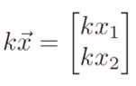
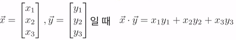
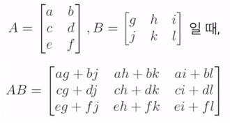
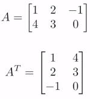

# 선형대수학 - Numpy

### 스칼라(Scalar)와 벡터(Vector)
* 스칼라: 길이, 넓이, 질량, 온도 등 크기만 존재 (숫자)
* 벡터: 속도, 위치 이동 등 스칼라인데 방향이 있는거(방향 + 스칼라)

### 벡터(Vector Arithmetic)

* 같은 차원일때만 계산 가능
* 벡터끼리 더하거나 빼거나 곱하거나 등등
* 벡터x = [x1, x2], 벡터y = [y1, y2] 일때  
  벡터x + 벡터y = [x1+y1, x2+y2]
* 벡터의 스칼라 곱

* 벡터가 다차원일 때도 같은 항끼리 더하거나 곱하기

### Norm

* 원점에서 벡터까지의 크기(거리)

### 내적

* 같은 차원일 때만 내적 가능
* 

### 행렬 

* 실수를 직사각형 모양으로 배열 한 것(벡터를 쌓아둔 것)

##### 행렬의 곱
* (3, 2) 행렬과 (2, 3) 행렬같이 외항의값과 내항의값이 동일 할 때만 가능
* (3, 2) 와 (2, 3)을 곱하면 (3, 3) 행렬이 나옴
* 
##### 전치행렬(Transponse)
* 원행렬의 행과 열을 뒤바꾼 행렬이다

* [                                                  

  ​	[1,1], [1,2], [1,3]           =>   [[1,1], [2,1], [3,1],[1,2],[2,2],[3,2]]

  ​	[2,1],[2,2],[2,3]

  ]

* 

### Numpy
* python 에서 사용되는 과학 컴퓨팅용 라이브러리
